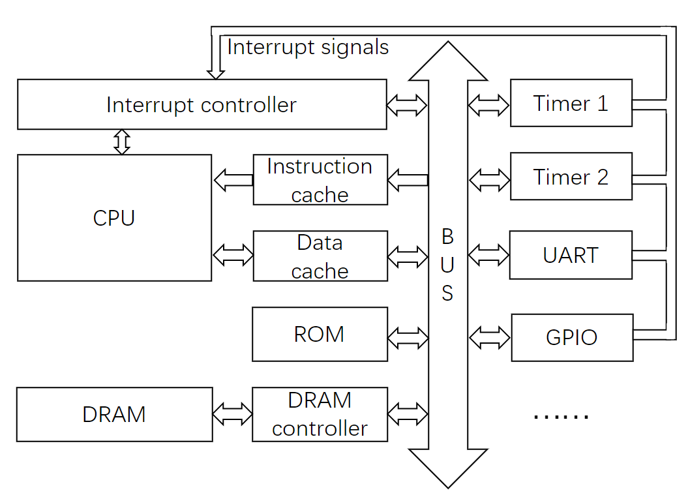
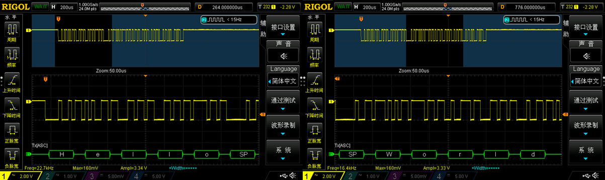
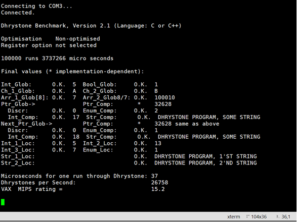

# SystemOT

## What is SystemOT?

SystemOT is just an open-source customizable system-on-chip soft-core. In a word, SystemOT is another **home-brew CPU** core.

## Why I designed SystemOT?
SystemOT names from System of Old Technology, this means that new technology and extreme performance are not the goal of the project.
SystemOT is a processor soft core designed for scientific research and education, and I design it **just because I can**.
Generally speaking, the goal of this project is to make it work, make it simple, and make it easy to understand.
Specifically, the long-term goal of this project is to make it work like a computer we use every day, with a working operating system and graphical interface and other input and output interfaces.

## Features

* The hardware of SystemOT is described with synthesizable Verilog HDL, without any third-party code and dependencies, so feel free to try it on your FPGA.
* The processor supports integer instructions commonly used in RISC systems, please refer to the [assembler template](https://github.com/gpthimble/Home-Brew-Computer/blob/master/sim/programs/otsys.asm) for the complete instruction list.
* The software tool chain support is relatively complete. You can use C language or assembly language to write programs. You can try to run the Dhrystone2.1 performance benchmark and other demo programs provided by this project.
* The processor provides some modern features, such as: Branch predictor, 2-way set associate cache, vector interrupt, high-level exception. The atomicity of multi-cycle instructions is provided by hardware. The synchronization of self-modifying code and cache is entirely processed by the hardware. The entire micro-architecture is transparent to programmers.
* Provide detailed documentation and development logs, including hardware development and tool chain targeting.
  

## Status and Road Map

### Hardware
|Milestone|Development|Validation|
|--------|---------|---------|
|System BUS| Done | Done|
|Cache| Done|Done|
|Processor|Done|Done|
|Memory Controller| Limited|Limited|
|Interrupt Controller| Limited| Limited|
|Timer| Done|Done|
|UART_TX|Done|Done |
|UART_RX|Planned|Planned|
|GPIO|Planned|Planned|
|MMU|Planned|Planned|
|VGA Interface| Planned|Planned|
|PS/2 Interface|Planned|Planned|
|SPI,I2C,Wishbone Bridge|Planned|Planned|


### Software
|Milestone|Development|Validation|
|--------|---------|---------|
|Port LCC 3.6 ANSI C Compiler| Done|Done|
|Port customASM Assembler|Done|Done|
|Pre-assembler|Done|Done|
|Software Multiply and Division from Libgcc|Done|Done|
|Drivers for UART_TX and Timer|Done|Done|
|Port Dhrystone 2.1 Benchmark|Done|Done|
|Software IEEE 754 Floating-Point|Planned|Planned|
|Port the Newlib|Planned|Planned|
|Port the Minix Operating System| Planned|Planned|

### Documentation
|Milestone|Status|
|--------|---------|
|Development Log|Growing|
|Translate the Development Log|Ongoing|
|Literate Programming|Ongoing|


## What is Included in the Project?

### Hardware


The hardware structure of SystemOT is shown in the figure above, which includes:
* **CPU**: 5-stage pipelined harvard architecture RISC processor with 32 32-bit general registers, 32-bit instruction word and 32-bit address lines. Load/store structure, support multi-cycle instructions (such    as unaligned load/store), branch prediction, advance exceptions, vector interrupt, and self-modifying code synchronization.
* **System BUS**: a very simple 32-bit tri-state parallel bus with a bus controller, supporting DMA operation, can work with any number of master and slave devices.
* **Cache**: 2-way set associative configuration, the replacement strategy is random replacement, the write strategy is write-through, and the hit data is ready in one cycle. The synchronization mechanism is completely implemented by hardware.
* **DRAM Controller**: simplified DRAM controller, its timing can be set by parameters, 32-bit word length, access by word.
* **I/O System**: memory mapped IO, UART, timer, GPIO and other I/O modules are directly connected to the system bus.
  
## Software

* Ported **LCC** 3.6 ANSI C [Compiler](https://github.com/gpthimble/lcc_3.6_port)
* Ported **customASM** [Assembler](https://github.com/gpthimble/customasm_port)
* [Pre-assembler](https://github.com/gpthimble/customasm_port/blob/master/pre_asm.py) Written by Python
* [Software Multiply and Division](https://github.com/gpthimble/customasm_port/blob/master/mul_div_mod.asm) Ported from **Libgcc**
* [Demo Programs and Functions](https://github.com/gpthimble/Home-Brew-Computer/tree/master/sim/programs)
* Ported [Dhrystone 2.1](https://github.com/gpthimble/Home-Brew-Computer/blob/master/sim/programs/dhrystone2_1.c) performance benchmark program

## Documents
You can find the detailed documentation and development log [here](https://gpthimble.github.io).


## Hierarchy in Files and Modules

```
SystemOT
|-- src\                         Verilog HDL source code of SystemOT
|   |-- soc.v                       SystemOT's top-level design
|   |   |-- cpu.v                       the processor module in SystemOT
|   |   |   |-- cache.v                     the cache module
|   |   |   |-- regfile.v                   the register file
|   |   |   |-- control_unit.v              the control unit
|   |   |   |-- alu.v                       the arithmetic unit
|   |   |   |   |-- add_sub.v                   module for addition and subtraction
|   |   |   |   |-- clo_clz.v                   module for the counting leading zeros and ones
|   |   |   |   |-- shifter.v                   module for the shifting operations
|   |   |-- bus_control.v               the BUS controller module in SystemOT
|   |   |-- dummy_slave.v               the Demo RAM controller module in SystemOT
|   |   |   |-- *.mif                       memory files contain the binary executable
|   |   |-- uart_tx.v                   the Demo UART TX and timer module in SystemOT
|   |   |-- timer.v                     the timer module
|   |   |-- dummy_master.v              the dummy DMA device for validation
|-- testbench\                   testbenches for SystemOT
|   |-- *.vwf                       wave form file for Intel Quartus
|   |-- *.v                         test bench written in Verilog HDL
|-- sim\                         simulation programs and result
|   |-- programs\                   programs used in simulations
|   |   |-- *.c                         programs written in C language
|   |   |-- *.asm                       programs in assembly
|   |   |-- otsys.asm                   assembly instruction template for customASM
|   |   |-- lib.asm                     function library for mul div mod timer and UART 
|   |-- results\                    simulation results
|   |   |-- *.vcd                       value change dump files of the simulations
|   |   |-- *.png                       screen shots of GTKwave
|--- some files generate by the Quartus software
```

## How to Use SystemOT

### 1. Build the Ported LCC 3.6 ANSI C Compiler
Get the ported LCC 3.6 compiler from [here](https://github.com/gpthimble/lcc_3.6_port).

I have modded the Makefile so that it can compile in ubuntu 18.04 lts in wsl.
It is worth noting that the complete LCC compiler includes an assembler and linker for each target, but the lcc 3.6 version does not provide binary output for Linux. Fortunately, because SystemOT does not currently have an operating system, The customASM assembler can directly generate binary executable code. Therefore, we only need to compile the components which processing the C language into assembly:

```
$make cpp       #build the C pre-processor
$make rcc       #build the C compiler
```
### 2. the Pre-assembler and the customASM Assembler

SystemOT currently **has no linker**. After the C language program is processed into assembly language by LCC, it needs to be processed by a pre-assembler before being assembled into a binary file.
The [pre-assembler](https://github.com/gpthimble/customasm_port/blob/master/pre_asm.py) used by SystemOT is a small parser written in Python. It analyzes the assembly code generated by LCC line by line, ignores some comments and pseudo-instructions that have nothing to do with the SystemOT , and records the segment where each line of instruction is located. 
When generating assembly code, it first allocates memory by defining the stack pointer as the maximum address of the system memory and generate a jump instruction to jump to the main function entry, then, according to the order of the code segment and the data segment, the previously scattered pieces of code are grouped together.
customASM is a customizable assembler, you can use it to generate binary executable for different target quickly with different instruction template.
You can use the [online version of customASM](https://hlorenzi.github.io/customasm/web/), just paste the instruction template from [here](https://github.com/gpthimble/Home-Brew-Computer/blob/master/sim/programs/otsys.asm), and add the content output by the pre-assembler and the content of [lib.asm](https://github.com/gpthimble/Home-Brew-Computer/blob/master/sim/programs/lib.asm) at the end of the assembly language program to get the compiled binary file. You can also use the customASM locally, but you may also need manually included the lib.asm at the end of the code segement of the pre-assembled code for the software multiply and division and the driver for uart and timer.


### 3. Hello World!
I will show you how to run the "Hello World" programs here.
```c
#helloworld.c
void putchar( char a);
void printstr (char * a);
int main()
{
    printstr("Hello World\n");
    while(1);
    return 0;
}

void printstr( char * a)
{
    char temp = *a;
    while (temp != 0)
    {
        if (temp == '\n')
        {
            putchar('\n');
            putchar('\r');
        }
        else
        {
            putchar(temp);
        }
        a = a+1;
        temp = *a;
    }
}
```
`lib.asm` provides the implementation of `putchar()`, as long as `lib.asm` is linked, it can be used directly in C language programs. As shown above, the hello world program implement the `printstr` function with `putchar()`.

Then we compile `helloworld.c` with the ported LCC compiler.
First, pre process it with the preprocessor:
```
 $./cpp helloworld.c helloworld_p.c
```
Then, compile it into assembly code:
```
$./rcc helloworld_p.c helloworld.asm
```
After that, we need to pre-assemble the output of the compiler with the pre-assembler:
```
$python pre_asm.py helloworld.asm helloworld_p.asm
```
It should be noted that the pre-assembler allocates memory by modifying the `$sp` register at the beginning of the program, so before using the pre-assembler, you should confirm that the value in `$sp` is consistent with the storage file size in `dummy_slave.v` and the memory capacity on the FPGA.

Then use any text editor to open `helloworld_p.asm`, paste the instruction template(`otsys.asm`) in the front of the file, paste the library (`lib.asm`) at the end of the code segment.

Finally, we can generate the executable binary with customASM:
```
customasm -f mif helloworld_p.asm -o helloworld.mif
```
Of course, above process can  be automated, but I haven't done this yet.

I have tested this on Terasic's DE0-nano board which has Cyclone IV series FPGA chip with model EP4CE22F17C6N onboard:
Create a new project in the Quartus software and load the verilog HDL files in the /src folder. 
Use the `memory size wizard` in Quartus process the generated mil file with options `word size = 32` and `combine existing words`. Then edit `dummy_master.v` to load the processed mif file.
The use  of SystemOT is similar to other processor soft cores. After editing the timing constraints and assigning the IO pins, the netlist can be generated and downloaded.

### 4. Proof of Work
Connected the pin assigned for UART_TX to a USB-RS232 converter or an oscilloscope, string "Hello World" can be read out, which is pretty cool!


With the same process above, I also successfully run the ported Dhrystone 2.1 performance benchmark. 
The instruction cache and data cache of SystemOT are configured to 4KB, the memory controller uses the fast mode, and the following results are obtained at 50Mhz frequency, which is not bad at all!



## References
1. B. Buzbee, [Homebrew CPU](http://www.homebrewcpu.com/)
2. M. M. Mano, Computer system architecture
3. A. S. a. W. A. S. Tanenbaum, Operating systems: design and implementation
4. Y. a. o. Li, Computer principles and design in Verilog HDL
5. D. Sweetman, See MIPS run
6. J. L. a. P. D. A. Hennessy, Computer architecture: a quantitative approach
7. R. P. Weicker, Dhrystone: a synthetic systems programming benchmark
8. C. W. Fraser, LCC A retargetable compiler for ANSI C
9. h. a. c. a. vascofazza, [customasm](https://github.com/hlorenzi/customasm)
10. D. E. Knuth, Literate programming
11. N. Ramsey, Literate programming simplified
12. [Minix Over Documenting Project](http://www.os-forum.com/minix/boot/index.php)
13. Mao yao，Yang songhua,[THE MINIX ASSEMBLY LANGUAGE MANUAL](http://www.woodhull.com/newfaq/faq/MinixAsMn.html)

